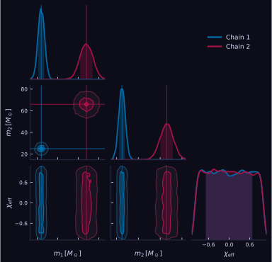

# User guide

## Data input

Cornetto takes a `dict[str, array]`. Arrays can be 1-D (single chain) or 2-D
`(N_chains, N_samples)` for multiple chains.

=== "Single chain"

    ```python
    data = {
        "m1": rng.normal(30, 4, 10_000),   # shape (N_samples,)
        "m2": rng.normal(25, 3, 10_000),
    }
    corner(data)
    ```

=== "Multiple chains"

    ```python
    data = {
        "m1": np.stack([chain_A["m1"], chain_B["m1"]]),   # (2, N_samples)
        "m2": np.stack([chain_A["m2"], chain_B["m2"]]),
    }
    corner(data, chain_labels=["GW150914", "GW190521"])
    ```

=== "Mixed shapes"

    1-D arrays are broadcast across chains. Useful for a shared prior parameter.

    ```python
    data = {
        "m1":    np.stack([chA_m1, chB_m1]),   # per-event  (2, N)
        "prior": rng.uniform(0, 1, 10_000),    # shared     (N,)
    }
    corner(data, chain_labels=["A", "B"])
    ```

=== "Sparse chains"

    Some chains may not have data for every parameter.  Pass a shorter 2-D
    array - trailing chains are automatically absent for that parameter:

    ```python
    data = {
        "mass": np.stack([chA_mass, chB_mass, chC_mass]),  # (3, N)
        "spin": np.stack([chA_spin, chB_spin]),            # (2, N) - chC absent
        "dL":   np.stack([chA_dL,   chB_dL]),              # (2, N) - chC absent
    }
    corner(data, chain_labels=["A", "B", "C"])
    ```

    For non-trailing absences, pass a list with `None` in the missing slot:

    ```python
    data = {
        "mass": np.stack([chA_mass, chB_mass, chC_mass, chD_mass]),  # (4, N)
        "spin": [chA_spin, chB_spin, None, chD_spin],                # chC absent
        "dL":   np.stack([chA_dL, chB_dL, chC_dL, chD_dL]),          # (4, N)
    }
    corner(data, chain_labels=["A", "B", "C", "D"])
    ```

    Absent chains are skipped in KDE, statistics, and all panels for that
    parameter. They still appear in the legend if given a `chain_labels` entry.

Hard cap: `MAX_CHAINS = 10`. Override per call with `max_chains=...`.

## Multi-chain plots

Each chain gets its own colour from `CORNETTO_PALETTE` (a jewel-tone palette of
10 entries). Legend, contour colours, and titles update automatically.

```python
corner(
    data,
    chain_labels=["GW150914", "GW190521"],
    truths={"m1": np.array([36.0, 85.0])},   # one truth per chain
)
```

For two chains where you want one on the lower triangle and the other on the
upper, use [`Cornetto.pairplot`](api.md#cornettopairplot):

```python
# %%
from cornetto import Cornetto

a = Cornetto(chain_A, chain_labels=["Model A"])
b = Cornetto(chain_B, chain_labels=["Model B"])
fig, axes = a.pairplot(b, other_label="Model B", other_color="coral")
fig.savefig("comparison.pdf", bbox_inches="tight")
```

## Weights

Importance-sampling weights are supported for every path (single, multi-event,
`summary()`, `quick_corner`).

```python
corner(data, weights=w)                      # one weight array for all events
corner(data, weights=[w_A, w_B])             # per-event
corner(data, weights=[w_A, None])            # event B uses uniform weights
```

Weights are normalised internally; NaN-ish samples are masked per-parameter.

## Subsampling

For heavy chains, thin before KDE to cut cost without changing the plot:

```python
corner(data, subsample=10_000)
```

The top-level `quick_corner` defaults to `subsample=20_000` for responsiveness.

## Statistics

The shaded band and central line on each 1-D panel come from a **stat function**.
Built-ins:

| `stat=`         | Central | Interval      |
| ---             | ---     | ---           |
| `"median"` (default) | median | 16 / 84 %    |
| `"median_mad"`  | median  | ± MAD          |
| `"median_hdi"`  | median  | 68 % HDI       |
| `"mean"`        | mean    | ± std          |

```python
corner(data, stat="median_hdi")
```

### Custom statistics

```python
def stat_mode(samples, weights=None):
    # your logic; must return this dict shape
    return dict(center=..., lo=..., hi=..., label="mode")

corner(data, stat=stat_mode)
```

### Contour levels

Pass n-sigma values; cornetto converts them to 2-D probability-mass levels via
`P(n) = 1 - exp(-n^2 / 2)`.

```python
corner(data, sigmas=(1, 2, 3))        # 39.3 / 86.5 / 98.9 %
```

## Appearance

Everything cornetto draws is configurable through plot kwargs. The sections
below group them by what they affect.

### Colors

Two ways to pick colors, plus one default that just works.

**Named palettes** - single-chain presets:

| Name         | Base colour |
| ---          | ---         |
| `"cornetto"` *(default)* | `#0072b2` ocean blue |
| `"indigo"`   | `#421eb8` |
| `"coral"`    | `#aa1348` |
| `"teal"`     | `#0da086` |
| `"gold"`     | `#c06b0c` |
| `"ink"`      | `#1e1b4b` |

```python
corner(data, color="coral")
```

**Explicit list** - one colour per chain. Accepts any matplotlib colour
(hex, `rgb(...)`, named CSS, etc.):

```python
corner(data, color=["#8E44AD", "#16A085"])
```

**Multi-chain default** - without `color=`, cornetto cycles through a 10-hue
perceptually-balanced palette (`cornetto.CORNETTO_PALETTE`) so two or more
chains are distinguishable at a glance.

### Theme

```python
corner(data, dark=True)
```



The dark theme is isolated from matplotlib's global `rcParams` - it applies
only to the current figure, even inside a notebook that sets its own style
elsewhere.

### Panels

Per-plot toggles that shape the look of individual panels:

| Kwarg             | Default | Effect                                              |
| ---               | ---     | ---                                                 |
| `fill_1d`         | `False` | Light tint under the 1-D KDE curve.                 |
| `fill_contours`   | `True`  | Filled bands under the 2-D contours.                |
| `contour_lw`      | `1.2`   | 2-D contour line width.                             |
| `show_titles`     | `True`  | `value⁺ᵃ₋ᵦ` heading above each diagonal panel (single chain). |
| `annotate_peaks`  | `False` | Tick marks at local PDF maxima on the diagonal.     |
| `show_tension`    | `False` | Overlap-integral annotation (meaningful for 2 chains). |
| `label_pad`       | `0.08`  | `hspace` / `wspace` between panels.                 |
| `fig_size_per_dim`| `2.0`   | Inches per parameter when `figsize` is unset.       |

### Truth markers

```python
corner(data,
       truths={"m1": 30.0},
       kwargs_truths={"ls": "-.", "lw": 1.5,
                      "marker": "*", "markersize": 8})
```

Defaults: red (`#e63946`), solid line, diamond marker. Override any
matplotlib line/marker kwarg through `kwargs_truths`.

### Delta mode

`delta_mode=True` subtracts the supplied truths from every chain and relabels
axes with a leading `Δ`. Handy to eyeball posterior deviations from the
injected/true values - everything centres on zero.

```python
corner(data,
       truths={"m1": 30.0, "m2": 25.0},
       delta_mode=True)
```

- Requires `truths` (raises `ValueError` otherwise).
- Per-chain truths (`truths={"m1": [30., 31.]}`) subtract one value per chain,
  so every chain collapses around zero regardless of its true injected value.
- Truth overlays are suppressed (they'd all lie at 0).
- `ax_lims` is interpreted in delta space (e.g. `{"m1": (-5, 5)}`).
- Works on `corner()`, `quick_corner()`, `marginal()`, `trace()`,
  `trace_marginal()`, and `pairplot()` (wherever `Cornetto` backs the plot).

### Statistic styling

Per-stat visual overrides (line style and fill alpha on the diagonal):

```python
corner(data, stat="median_hdi",
       kwargs_stats={"median_hdi": {"lw": 1.5, "alpha": 0.35}})
```

### Fine control - the `Cornetto` class

For repeated plots from the same dataset (no recomputation) or to inspect
what was actually drawn:

```python
c = Cornetto(data, chain_labels=["chain"])
fig, axes = c.plot(color="teal", dark=True)
c.info()              # print the exact setup used
c.summary()           # summary table (HTML in Jupyter)
print(c.latex())      # LaTeX table
```

## Visual isolation from `rcParams`

Matplotlib's global state can leak across cells: if a notebook ran
`plt.rcParams["font.size"] = 20` earlier, every plot afterwards is affected.
Cornetto wraps all drawing in `plt.style.context("default")` and its own rc
overrides, so your corner looks the same regardless of what ran before it.

## Summary tables

```python
# %%
c = Cornetto(data, chain_labels=["mock"])
tbl = c.summary()
tbl                        # renders as HTML in Jupyter
print(tbl)                 # plain text in the terminal
print(c.latex(caption="Posterior summary"))   # astropy-backed LaTeX
```

Columns: `median`, `p16`, `p84`, `mean`, `std`, one row per (param, chain).

## Known gotchas

- **LaTeX math in labels** needs raw strings (`r"$m_1$"`). `text.usetex` is
  not required; cornetto forces it off for efficiency.
- **`N_samples` below ~50** disables KDE for that panel and falls back to a
  histogram (with a `RuntimeWarning`).
